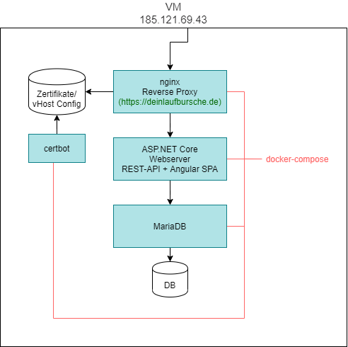

# Architekturdokumenation

## Infrastruktur

## Software

### Frontend
#### Get Started
* Repo clonen
* cd ClientApp
* npm install
* ng serve
* im Browser unter `http://localhost:4200` die App benutzen

#### Routing
Vorhandene Routen:
1. `/order` -> Order-Flow ("Hilfe bekommen" als Käufer)
2. (wip) `/offer-help` -> OfferHelp-Flow ("Hilfe anbieten" als Laufbursche)
3. (offen) `/merchant` -> Merchant-Flow ("Produkte verkaufen" als Händler)

#### Lazy-Loading
Der Code einer jeden Route ist in einem eigenen Modul (hier "area" genannt) gekapselt, welches unter `src/app/areas/XYZ` liegt.
Diese Module werden `lazy-loaded`, also vom Browser nur bei Bedarf heruntergeladen. Initiale Ladezeiten werden so gering gehalten.

#### Geteilter Code
Code-Teile die von mehreren areas genutzt werden, sind aktuell noch in `/src/app/` abgelegt.

#### Backend-Kommunikation
Jede Domain hat einen eigenen Service (bspw. `OrderService`), sowie ein Gateway (bspw. `OrderGateway`).
Das Gateway kommuniziert direkt mit dem Backend. Die gelieferten Daten werden vom Service entsprechend gemapped und dann für die konsumierenden Komponenten verfügbar gemacht. 

#### Ablauf Order-Flow
Ein Nutzer beginnt stets in der `FirstViewComponent`, in der die Auswahl getroffen wird, welche "Rolle" der Nutzer nun einnehmen möchte (Käufer, Laufbursche oder Händler).
Für den Order-Flow wird ein Käufer im nächsten Screen dazu aufgefordert ein Produkt für seine Bestellung zu wählen, indem er den Namen des Produktes, die gewünschte Menge sowie einen maximalen
Preis angeben kann. Ebenfalls besteht die Möglichkeit einen Kommentar zu hinterlassen, um ggfs. Wünsche zu äußern.
Es können bei Bedarf weitere Produkte hinzugefügt werden. Schlussendlich kann die Bestellung abgeschickt werden und der Nutzer landet auf einer Übersichtsseite mit allen Bestelldetails.

#### Ablauf Offer-Help-Flow
Wählt ein Nutzer auf der Startseite den Punkt "Ich möchte helfen" wird dieser in den Lieferantenworkflow weitergeleitet. Hier bekommt er offene Bestellungen angezeigt. 
Dort kann er sich direkt Details zu den in den Bestellungen vorhandenen Produkten anzeigen lassen und kann sich dazu entscheiden diese Bestellung zu liefern. 
Über einen weiteren Button kann er sich die Bestellungen anzeigen lassen die er ausliefern will.

#### Ablauf Merchant-Flow
TBD

# Angedachte Verbesserungen
* WIP-Flows implementieren
* Einheitlicher Code-Style via eslint, tslint, ...
* Einheitliches Design implementieren
* Test-driven arbeiten
* Geteilte Ressourcen (Services, Models, ..) im `/src/app/core/shared` verschieben
* State-Management via NGRX global für die App einführen
* Payment-System anbinden
* Nutzerverwaltung mit auth0 anbinden
* Merchant-Flow implementieren

### Backend

* ASP.NET Core / Kestrel
* OAuth (vorbereitet)
* Entity Framework (Code First)
* Maria DB

### Entwicklung

* github (https://github.com/laufburschen/hackaton)
* dockerhub (wirvsvirusgs/deinlaufbursche)), automatisierter Build bei Änderung in github
* auf VM wird ein docker-compose benötigt; dieses muss bei Bedarf manuell neu gestartet werden

* Visual Studio Code & Professional
* Postman
